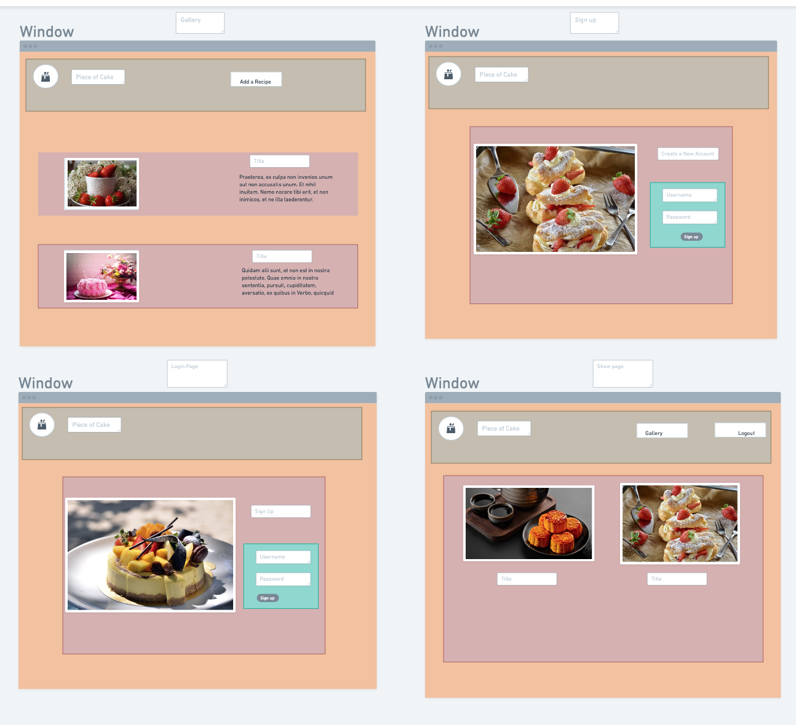

# Piece_of_cake

## Contents
* [Title](#piece-of-cake)
* [Path](#path-followed)
* [Goal](#the-goal)
* [Technologies](#technologies-used)
* [Challenges](#challenges-faced)
* 
* [DeployedLink](https://piece-of-cake1.herokuapp.com/login)
* [Created By](#created-by)
* [Inspiration](#inspirational-quote)
* [Future Enhancements](#future-enhancements)

### Path followed
If you own a smartphone, chances are you have apps for everything from social media to banking and even transportation. These apps keep life organized when you’re on the go and help increase efficiency in many regards. 
Piece of Cake allows you to save your favorite recipes, ingredients in one place.

 
### The Goal
My goal is to get a fully functional Dessert Recipe manager app with the full CRUD operations.

### Technologies used

* HTML.
* CSS.
* Javascript.
* GoogleFonts
* jquery.
* Bootstrap
* Materialize
* Express
* Sass

### Challenges Faced
The challenge I faced was converting some of my properties like ingredients and directions from a string to an Array. 

## Screenshots
# Deployed Link

## Created By
Keara Pereira

## Inspirational quote 
“Don’t quit because you are not good enough, keep going because you are not good enough yet.

## Future Enhancements
* Meal Planner
* Enable Users to add rewiews 
* Shopping List
